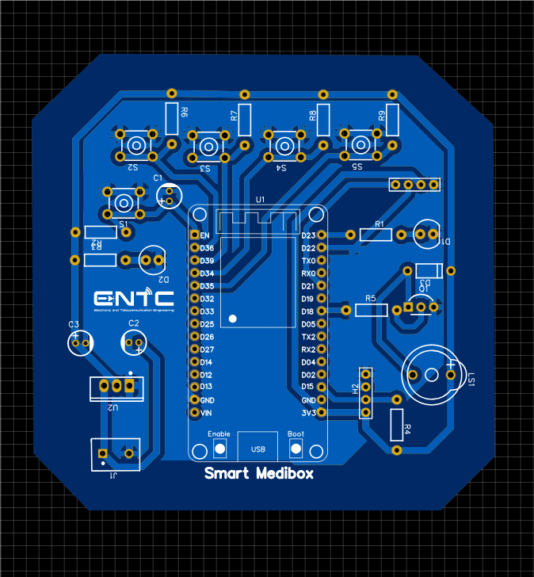
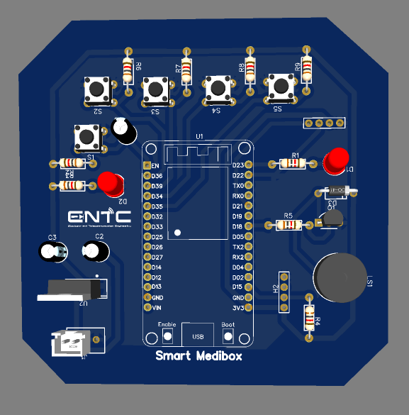
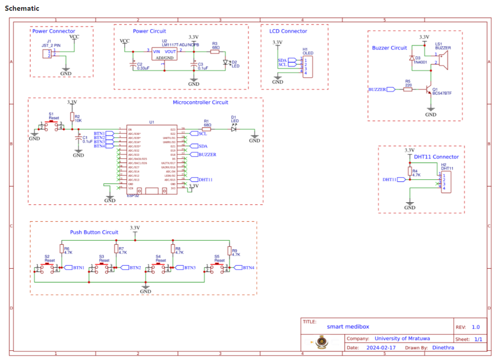
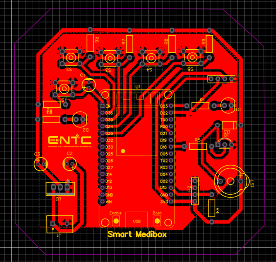
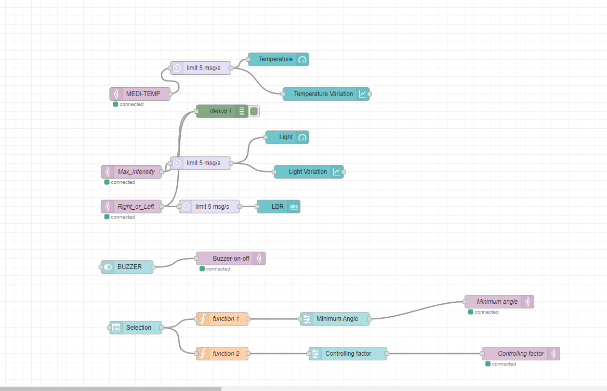
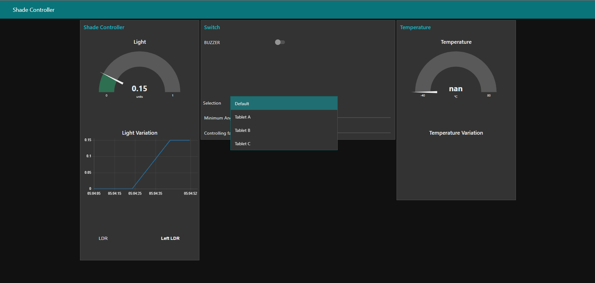

<!DOCTYPE html>
<html lang="en">
<head>
    <meta charset="UTF-8">
    <meta name="viewport" content="width=device-width, initial-scale=1.0">
  
</head>
<body>

<h1>Smart MediBox</h1>

<h2>Table of Contents</h2>
<ul>
    <li><a href="#description">Project Description</a></li>
    <li><a href="#features">Features</a></li>
    <li><a href="#components">Components</a></li>
    <li><a href="#how-it-works">How It Works</a></li>
    <li><a href="#usage">Usage</a></li>
    <li><a href="#pcb-design">PCB Design</a></li>
    <li><a href="#node-red-flow">Node-RED Flow</a></li>
    <li><a href="#dashboard">Dashboard</a></li>
</ul>

<h2 id="description">Project Description</h2>

The Smart MediBox is an innovative device created to assist users in managing their medication schedules effectively. It provides timely audio and visual reminders to take medications, tracks environmental conditions, and connects to a web-based dashboard for remote management. This ensures that users never miss a dose and that medications are stored in optimal conditions.

<h2 id="features">Features</h2>
<ul>
    <li><strong>Medication Reminders:</strong> Emits an alarm at pre-set times to remind users to take their medications.</li>
    <li><strong>Environmental Monitoring:</strong> Uses a DHT11 sensor to check temperature and humidity inside the MediBox, with an alarm if conditions are unsuitable.</li>
    <li><strong>Display Information:</strong> Displays the current time, date, and alarm information on an OLED screen.</li>
    <li><strong>User Interaction:</strong> Users can set the time, date, and alarms via push buttons during startup.</li>
    <li><strong>Remote Management:</strong> Offers a web-based dashboard for monitoring and controlling settings over Wi-Fi.</li>
</ul>

<h2 id="components">Components</h2>
<ul>
    <li><strong>Microcontroller:</strong> ESP32</li>
    <li><strong>Sensors:</strong> DHT11 for temperature and humidity</li>
    <li><strong>Display:</strong> OLED screen for visual feedback</li>
    <li><strong>Audio Alert:</strong> Buzzer for sound notifications</li>
    <li><strong>Indicators:</strong> LED lights for visual alerts</li>
    <li><strong>Input Controls:</strong> Push buttons for setting time, date, and alarms</li>
    <li><strong>Connectivity:</strong> Wi-Fi for communication with the web-based dashboard</li>
</ul>

<h2 id="how-it-works">How It Works</h2>
<ol>
    <li><strong>Initialization:</strong> Upon startup, the user sets the current time, date, and medication alarm times using the push buttons.</li>
    <li><strong>Monitoring:</strong> The MediBox constantly monitors the internal temperature and humidity using the DHT11 sensor.</li>
    <li><strong>Alerts:</strong> 
        <ul>
            <li>Alarms when it's time for the user to take their medication.</li>
            <li>Alarms if temperature or humidity falls outside the recommended range, ensuring proper medication storage.</li>
        </ul>
    </li>
    <li><strong>Display:</strong> The OLED screen shows the current time, date, and upcoming alarm information.</li>
    <li><strong>Remote Access:</strong> The device connects to a Wi-Fi network, allowing users to monitor and control the MediBox via a web-based dashboard.</li>
</ol>

<h2 id="usage">Usage</h2>
<ol>
    <li><strong>Setup:</strong> Plug in the MediBox and configure initial settings using the push buttons.</li>
    <li><strong>Operation:</strong> The device will automatically provide reminders and monitor environmental conditions.</li>
    <li><strong>Web Dashboard:</strong> Use the web dashboard from any internet-enabled device to manage settings and view alerts.</li>
</ol>

<h2 id="pcb-design">PCB Design</h2>

Unlike the previous version's two-layer PCB, the updated Smart MediBox now features a single-layer PCB design, making it more cost-effective and easier to produce.

<h3>2D View</h3>

<h3>3D View</h3>

<h3>Schematic</h3>

<h3>Top Layer</h3>

<h2 id="node-red-flow">Node-RED Flow</h2>

<h2 id="dashboard">Dashboard</h2>

</body>
</html>
